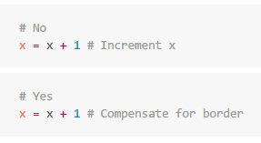

# Contributing to Pluralsight Planner

This guideline clarifies strict quality rules we have set to ensure our project
evolution is controlled and efficient, that developers can maintain this product
with minimal stress, following modern development patterns. In other words...
We aim to have a good time and learn something new each day instead of tracking
bugs or fighting spagetti monster.

What will be described here:

- How to add issues / report bugs
- Checklist before creating Merge Request
- Checklist for reviewers
- Release strategy

## Tools & Prerequisites

As a contributor, you can choose whatever editor you want, however we prepared
workspace settings to make it development with Visual Studio Code real pleasure.
If you don't want to use this editor, this is by no mean any excuse from adding
badly formatted crappy code or invalid commits.

Of course we use Node.js and Gulp. Everything is written in JavaScript these days,
right? Make sure you have latest LTS Node version installed and you are ready to go :)

## New issues / bugs

Before you start writing new issue, choose proper template (User Story|Task|Bug).
You have a right to suggest new template or updates to existing one. Be aware that
adding issue without description will get you nowhere, core contributors will clean
it up and forget it ever existed.

Use labels so that you won't need to write a book chapter in the description. Some
labels are used to set approximate scope of work until we are ready to deliver next
version of the product. These are reserved to core team. If you are not a member of
the core team, please use only labels prefixed: `type:*`, `scope:*` and `effort:`.

If you are not sure which milestone to choose, just leave the field empty. Someone
from the team will assign it to the right feature/concept.

### Feature requests

Feature requests are welcome. Take a moment to find out whether your idea fits the
project. Please provide as much detail and context as possible, so we can reduce
time wasted on requirements specification to the minimum.

## Git workflow

Start with making sure you are assigned to an existing issue in GitLab. Move it
to "Doing" column, so that you communicate clearly that you work on getting it
done. Avoid taking more than one issue into "Doing".

Our StyleGuide is current look&feel of Pluralsight. Keep in mind most of the features
should nicely blend into the existing website instead of standing out. When creating
custom components, you should get highly inspired by whatever exists on Pluralsight.
Same rule applies to UX and language of user-facing messages.

### Branching strategy

You should generally avoid vague branch names as well as camelCase. There is not
much more to say.. Just follow these examples:

- `task/task-short-name`
- `feature/#123/feature-short-name`
- `bug/#321/fix-something`

### High quality history

Commit messages are critical to project evolution history readability, changelog
generation and troubleshooting. We expect you prepare your Merge Request respecting
future contributors by:

- avoiding empty commits
- squashing commits into one
- avoiding middle commits that introduce inconsitent state (e.g. broken build, missing tests/docs)
- review all changes to check if any file history will be accidentally lost (fix it immediately)
- making it as easy as possible to understand what is the purpose of the changes included in each Commit

While these rules are mostly pretty clear, the last one might cause some somee trouble.
To reduce cognitive effort while inventing proper commit message, consider following
example as a rule of thumb:



Ideally we would like to have commits introducing only valuable changes that move project forward.
If we strive to make this happen, **history will store conclusions, not conversations**. Following example
explains my point of view:

```txt
// BAD:

[#ABC] Chore: Remove useless files
[#ABC] Refactoring: Some technical debt
[#ABC] Feature: Introducing some functionality
[#ABC] Refactoring: Adding tests and changing architecture of the feature
[#ABC] Fix: Restore files removed previously - it was not a good idea

// GOOD:

[#ABC] Feature: Introducing some functionality
```

### Format of commit messages

```txt
[{#ID}] {type}: {subject}

{body (optional)}
```

Example:

```txt
[#ABC] Feature: Added possibility to remove multiple playlists at once

- Added checkboxes, so user can select multiple visible playlists
- Displayed "delete" control visible if any playlist is selected
- Moving all playlists data to trash after user confirmed his decision
```

```txt
[#XYZ] Chore: Updated NPM dependencies
```

#### Allowed `{type}`

- **Feature**
- **Fix** (bug fix)
- **Docs** (documentation)
- **Style** (formatting, missing semi colons, ...)
- **Refactoring** (fixing linters errors, code reorganization and improvements)
- **Test** (when commit is only about adding/updating tests)
- **Chore** (maintenance, CI)
- **Cleanup**

### Checklist before creating Merge Request

Of course, you can use Merge Requests with `WIP:` prefix to get early feedback.
This checklist apply to the state in which you consider your changes ready to be merged.
No matter how discipline you are, there is always a chance one of the points was
missed. To avoid being rejected due to some stupid mistake irrelevant to the brilliant
change you made, please follow these simple list:

- [ ] Rebase using `git rebase origin master` (update master first!)
- [ ] Avoid copying libraries code into our sources. Check licensing if you are forced to do it because it is not possible to add NPM dependency
- [ ] Is branch name valid? It is extremely easy to change with `git branch -m "new/name"`
- [ ] Are all commits squashed? Is there a good reason if not?
- [ ] Are commit messages following convention described above?
- [ ] Is `Closes #ID` included in Merge Request description? (in case it should be)
  - [ ] If you are willing to close an issue, make sure all Acceptance Criteria are covered
  - [ ] If you cannot set closing, is there any benefit from merging unfinished change?

### Checklist for reviewers

First of all. Reviewer should treat codebase as his/her child. Authors of changes should
be prepared to see reviewers asking questions, suggesting better solutions and generally
protecting project from crap with their own body.

> If something looks like a tentacle of spagetti monster 🐙... kill it! Kill it with fire 🔥

- Compliance with issue title and description
  - [ ] Ask if missing parts were already done in different MR
  - [ ] Suggest updating issue description if the scope changed

- Code quality (things that should make MR rejected automatically)
  - [ ] Broken build
  - [ ] Single responsibility violation
  - [ ] Code readability degradation
  - [ ] OOP / procedural code when functional way is actually easier and cleaner
  - [ ] Overcomplicated logic / design
  - [ ] Temporary solution
  - [ ] Dead code, TODOs

- Clear purpose of the changes
  - [ ] Only relevant changes should go through
  - [ ] Expect clear messages of included commits

- Git history readability
  - [ ] Expect commits messages following convention specified above
  - [ ] Suggest split or squash of commits when it may significantly improve troubleshooting in the future
  - [ ] Check for loosing files history after renaming and updating content


## Release strategy

Release procedure:

- Prepare release note for non-technical end users (from changelog)
- Add new tag on the master branch
- Repack extension archive, publish generated *.zip
- Bump version in manifest

### Milestones and versioning

SemVer does not fit user-facing projects. Instead let's try something different.
Something more friendly to non-technical users. We have to anticipate that users
will expect:

- not to relearn UI often
- to be notified about changes rather not frequently
- drastic UI changes as a cost to improve their overall productivity
- to be informed how these changes make the product fit their needs
- to have features so simple to use that onboarding is not required

To make versioning user-oriented, we try to work following these simple rules:

1. Adopt feature maturity model (one of listed below or hybrid)
   - G1-5 (_generation_-based maturity model, my own invention)
      - G-1: Good enough + tests
      - G-2: Discoverability + minor UX improvements
      - G-3: Monitoring + Analytics
      - G-4: Shortcuts for Power users
      - G-5: Bulletproof (improved errors toleration, simplified)
   - Common 3-stage model:
      - experimental
      - stable
      - deprecated
1. Hide new features behind toggles until they are in a stable stage
   - This also applies to disabling (or replacing) deprecated features
   - Treat major releases as opportunity to introduce multiple stable features (effectively removing its toggles)
1. Keep versions as labels and leave milestones for features*

\* This may also help us improve feature "completion" visibility and avoid
leaving features in _somehow-working_ and _pissing-users-off_ stages. With
milestone per feature we will clearly see which of the main features are
ready to be published within next major release.